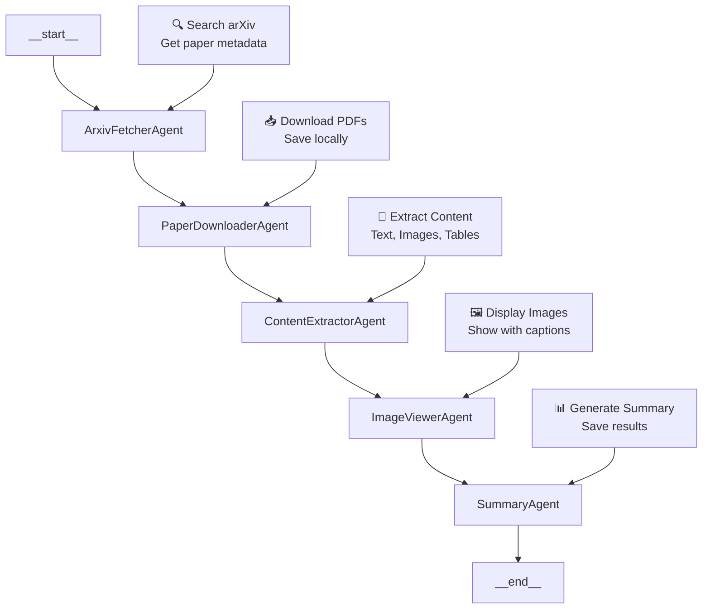

# Data Ingestion Module

This module contains the complete arXiv paper processing pipeline using LangGraph multi-agent system.

## Files

- **`arxiv_langgraph.py`** - Complete LangGraph multi-agent system for paper processing
- **`ingest.py`** - Simple command-line interface to activate the pipeline
- **`requirements.txt`** - Python dependencies for the data ingestion system
- **`README.md`** - This documentation file

## Features

### 🤖 Multi-Agent Workflow



**Workflow Description:**
```
START → ArxivFetcherAgent → PaperDownloaderAgent → ContentExtractorAgent → ImageViewerAgent → SummaryAgent → END
```

### 🔧 Capabilities
- **arXiv Search** - Find papers by topic
- **PDF Download** - Automatic download
- **Text Extraction** - Markdown format
- **Image Extraction** - PNG/JPG with captions
- **Table Extraction** - CSV format
- **Caption Detection** - Automatic figure captions
- **Image Display** - Matplotlib visualization
- **Download Option** - Copy displayed images
- **Processing Summary** - JSON results

## Usage

### Basic Usage
```bash
# Process papers with image display
python ingest.py "machine learning" --max-papers 5

# Process without image display
python ingest.py "deep learning" --max-papers 3 --no-images

# Get help
python ingest.py --help
```

### Options
- `--max-papers N` - Number of papers to process (default: 5)
- `--no-images` - Skip image display during processing

## Output Structure

```
downloads/ai_ml_nlp_extracted/
├── {paper_id}/
│   ├── text/{paper_id}.md          # Extracted text
│   ├── images/                     # All figures/diagrams
│   │   ├── page1_img1.png
│   │   └── image_captions.json     # Caption data
│   └── tables/                     # All tables
│       ├── table_1.csv
│       └── table_2.csv
└── processing_results.json         # Summary & metadata
```

## Installation

1. Install dependencies:
```bash
pip install -r requirements.txt
```

2. Run the pipeline:
```bash
python ingest.py "your research topic"
```

## Dependencies

- **LangGraph** - Multi-agent workflow framework
- **arXiv** - Paper fetching
- **PyMuPDF** - PDF processing and image extraction
- **Camelot** - Table extraction
- **Matplotlib** - Image display
- **Pandas** - Data processing

## Examples

### Machine Learning Papers
```bash
python ingest.py "machine learning" --max-papers 3
```

### Computer Vision Papers
```bash
python ingest.py "computer vision" --max-papers 5 --no-images
```

### Natural Language Processing
```bash
python ingest.py "natural language processing" --max-papers 2
```

## Notes

- Images are displayed using matplotlib with captions
- Tables are extracted in CSV format for easy analysis
- Text is saved in markdown format for readability
- All processing results are saved in JSON format
- The system can download displayed images on demand
